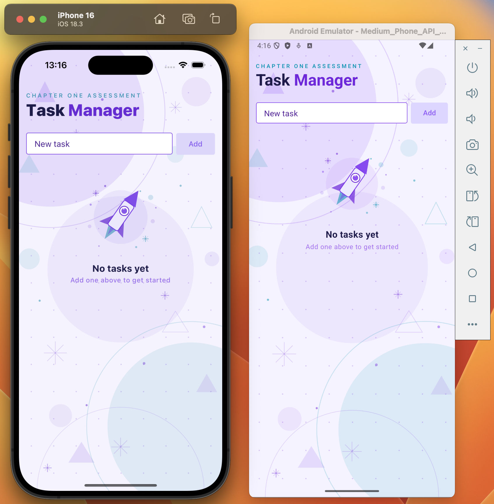
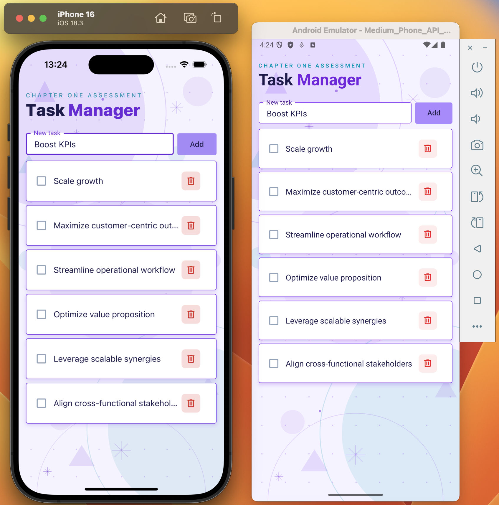

# Chapter One Assessment - Task Manager App

## Project Overview

React Native Task Manager app built with Expo allowing users to add, complete, and delete tasks.

## Screenshots

| No Tasks | With Tasks |
|----------|------------|
|  |  |

## Commands

- `npm start` — start Expo dev server
- `npm test` — run all tests with Jest
- `npm run lint` — run ESLint
- `npm run format` — format all files with Prettier
- `npm run format:check` — check Prettier formatting without writing (CI-friendly)

## Tech Stack

- **Expo** (~54.0) with Expo Router for file-based routing
- **React Native** (0.81) + **React** (19.1)
- **TypeScript** with strict mode
- **NativeWind** (v4) for Tailwind CSS styling
- **React Native Paper** for Material Design UI components
- **react-native-svg** for SVG background decorations
- **Jest** + **React Native Testing Library** for testing
- **Prettier** + **ESLint** for code formatting and linting

## Project Structure

```
├── app/
│   ├── _layout.tsx            # Root layout with Stack navigator + PaperProvider
│   ├── index.tsx              # Main screen composing Header, AddTask, TaskList
│   ├── index.test.tsx         # Integration tests for the main screen
│   ├── components/
│   │   ├── AddTask.tsx        # Text input + button for adding tasks
│   │   ├── AddTask.test.tsx   # Tests for AddTask component
│   │   ├── Background.tsx     # Absolute SVG background with cosmic decorations
│   │   ├── Background.test.tsx# Tests for Background component
│   │   ├── Header.tsx         # App title heading with two-tone cosmic style
│   │   ├── Header.test.tsx    # Tests for Header component
│   │   └── TaskList/
│   │       ├── index.tsx          # FlatList composing TaskEmpty and TaskItem
│   │       ├── TaskEmpty.tsx      # Empty state illustration and message
│   │       ├── TaskItem.tsx       # Single task row with checkbox and delete button
│   │       └── TaskList.test.tsx  # Tests for TaskList component
│   └── hooks/
│       ├── useTasks.ts        # Custom hook managing task state and actions
│       └── useTasks.test.ts   # Tests for useTasks hook
├── theme/
│   ├── colors.ts              # CosmicColors tokens + CosmicTheme (MD3LightTheme)
│   └── colors.test.ts         # Tests for color tokens and theme
└── types/
    └── Task.ts                # Task interface (id, description, completed)
```
